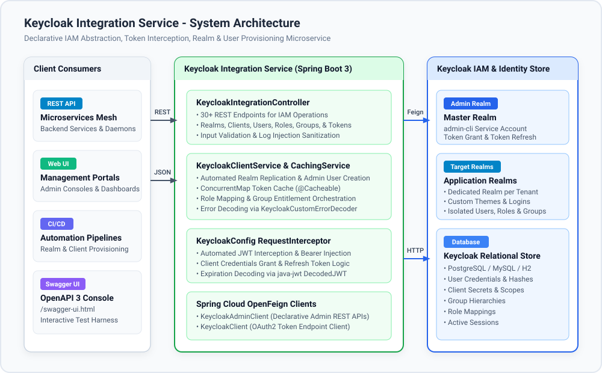
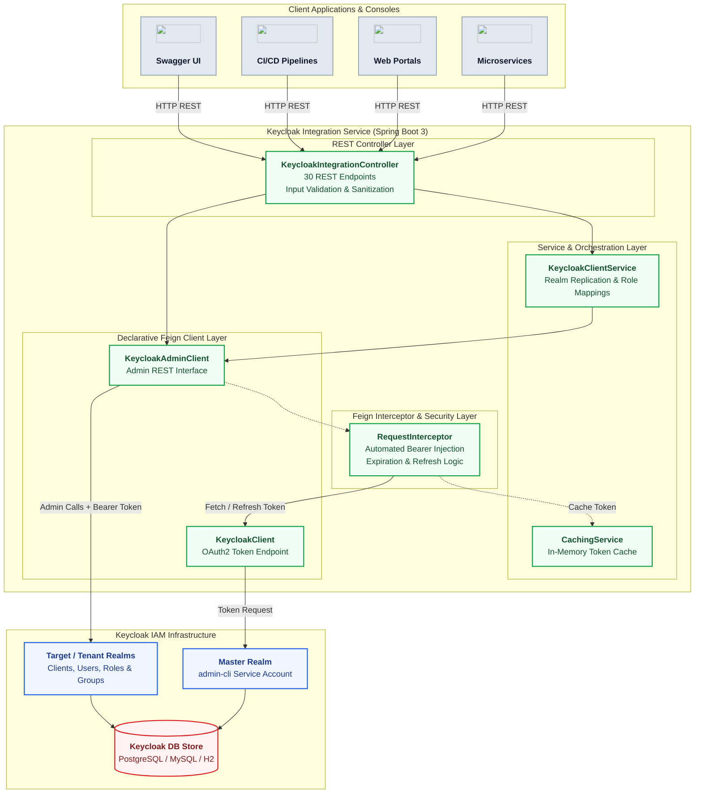
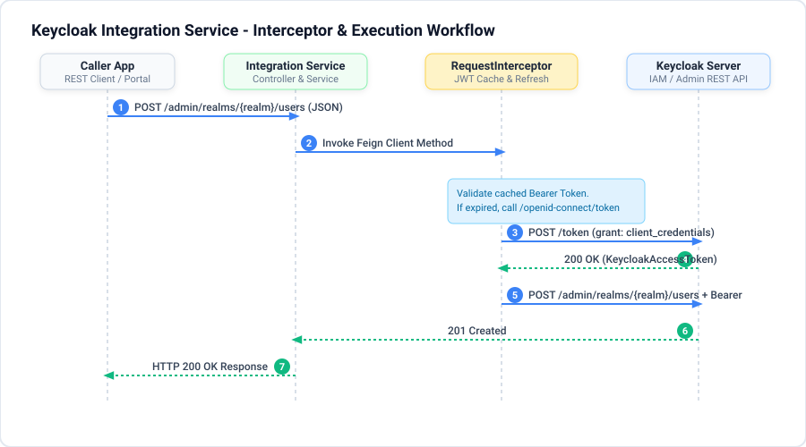
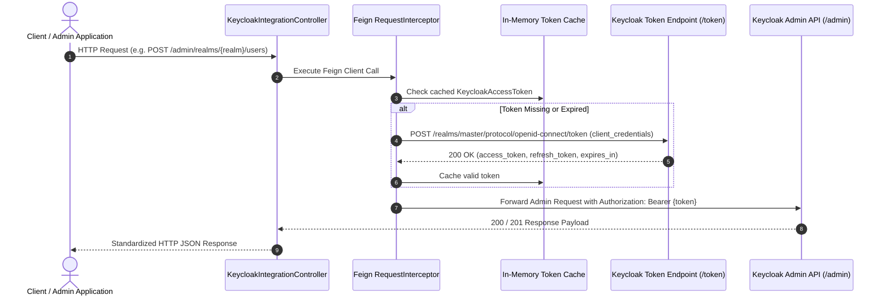

# PICC-PC-Keycloak-Integration

[](https://openjdk.org/)
[](https://spring.io/projects/spring-boot)
[](https://www.keycloak.org/)
[](https://spring.io/projects/spring-cloud-openfeign)
[](LICENSE)
[](https://github.com/Nubo-Native-Platform/PICC-PC-Keycloak-Integration/actions)

An enterprise-grade, declarative Identity and Access Management (IAM) abstraction microservice built on **Spring Boot 3**, **Spring Cloud OpenFeign**, and **Keycloak 24+**.

Designed for high-throughput identity provisioning, multi-tenant realm lifecycle management, role-based access control (RBAC), group entitlement mappings, and transparent OAuth2 administrative token interception and renewal.

---

## Table of Contents

- [Key Features](#key-features)
- [Architecture & Workflow](#architecture--workflow)
  - [System Architecture](#system-architecture)
  - [Service Component Topology](#service-component-topology)
  - [Execution & Token Interception Sequence](#execution--token-interception-sequence)
- [Configuration Reference](#configuration-reference)
- [Quick Start](#quick-start)
  - [1. One-Click Local Setup with Docker Compose](#1-one-click-local-setup-with-docker-compose)
  - [2. Run Directly with Maven Wrapper](#2-run-directly-with-maven-wrapper)
- [API Documentation & Swagger UI](#api-documentation--swagger-ui)
- [REST API Reference](#rest-api-reference)
- [Security & Compliance](#security--compliance)
- [Documentation Guides](#documentation-guides)
- [License](#license)

---

## Key Features

- **Declarative IAM Abstraction**: Encapsulates Keycloak's REST APIs behind type-safe, declarative Spring Cloud OpenFeign clients, eliminating ad-hoc HTTP boilerplate.
- **Transparent Token Interception**: Built-in Feign `RequestInterceptor` automatically acquires, caches in-memory, validates expiration, and seamlessly renews administrative JWT bearer tokens using OAuth2 client credentials and refresh token flows.
- **Full Identity Lifecycle Management**: End-to-end endpoints for user registration, user profile modifications, credential resets, email action triggers (`forgotpass`, `verifyemail`), and account termination.
- **Multi-Tenant Realm Orchestration**: Programmatic creation, configuration, and inspection of isolated realms with custom login themes and security profiles.
- **Client & Role-Based Access Control (RBAC)**: Fine-grained management of OpenID Connect (OIDC) clients, realm roles, and client-specific roles.
- **Group Entitlement Hierarchies**: Creation of organizational groups and bulk mapping of realm and client roles directly to user groups.
- **Automated Environment Replication**: Dedicated `/envrep/{envCode}` endpoint that provisions a complete isolated realm, admin user, and automatically binds the `realm-admin` administrative role.
- **DevSecOps & Supply Chain Hardening**: Rigorous static analysis via SpotBugs + FindSecBugs, vulnerability auditing via OWASP Dependency-Check, CycloneDX Software Bill of Materials (SBOM) generation (CNCF compliant), and Log Injection (CRLF / CWE-117) mitigation.

---

## Architecture & Workflow

### System Architecture





### Service Component Topology

| Component / Layer | Official Badge | Role & Responsibility | Default Port / Protocol |
| :--- | :--- | :--- | :--- |
| **Spring Boot Core** | [](https://spring.io/projects/spring-boot) | REST Ingestion API, input validation, service orchestration | `8080 / HTTP` |
| **Spring Cloud OpenFeign** | [](https://spring.io/projects/spring-cloud-openfeign) | Declarative HTTP client binding for Keycloak Admin & Token APIs | Internal HTTP Client |
| **Keycloak IAM Server** | [](https://www.keycloak.org/) | Identity store, token issuance, authentication & authorization engine | `8081 (Docker) / 8080 (Internal)` |
| **Springdoc OpenAPI 3** | [](https://swagger.io/) | Dynamic REST API specification, schema documentation, and Swagger UI | `/swagger-ui.html` |
| **Java Platform** | [](https://openjdk.org/) | Modern Long-Term Support (LTS) Java virtual machine environment | JVM 21 Runtime |
| **Docker & Compose** | [](https://www.docker.com/) | Containerized multi-stage packaging and turnkey orchestration | Docker Engine |

### Execution & Token Interception Sequence





---

## Configuration Reference

All properties can be configured via `application.properties`, externalized `.env` files, or mapped directly to standard environment variables.

### Core and Server Properties

| Property Name | Environment Variable | Default Value | Description |
| :--- | :--- | :--- | :--- |
| `server.port` | `PORT` / `SERVER_PORT` | `8080` | Port on which the HTTP server listens |
| `spring.application.name` | `SPRING_APPLICATION_NAME` | `keycloak-integration` | Application identifier |
| `spring.profiles.active` | `SPRING_PROFILES_ACTIVE` | `standalone` | Active Spring profile |
| `spring.cloud.config.enabled` | `SPRING_CLOUD_CONFIG_ENABLED` | `false` | Enable/disable Spring Cloud Config Server |

### Keycloak IAM Connection Properties

| Property Name | Environment Variable | Default Value | Description |
| :--- | :--- | :--- | :--- |
| `keycloak.url` | `KEYCLOAK_URL` | `http://localhost:8081` | Base URL of the Keycloak server instance |
| `keycloak.master.realm` | `KEYCLOAK_MASTER_REALM` | `master` | Administrative realm used for token authentication |
| `keycloak.client_id` | `KEYCLOAK_CLIENT_ID` | `admin-cli` | Client ID configured for service authentication |
| `keycloak.client_secret` | `KEYCLOAK_CLIENT_SECRET` | *(empty)* | Client secret (if using confidential client) |
| `keycloak.grant_type_client_credentials` | `KEYCLOAK_GRANT_TYPE_CLIENT_CREDENTIALS` | `client_credentials` | OAuth2 grant type for service authentication |
| `keycloak.grant_type_refresh_token` | `KEYCLOAK_GRANT_TYPE_REFRESH_TOKEN` | `refresh_token` | OAuth2 grant type for renewing tokens |

### OpenAPI / Swagger UI Properties

| Property Name | Default Value | Description |
| :--- | :--- | :--- |
| `springdoc.swagger-ui.path` | `/swagger-ui.html` | Web UI console path for Swagger documentation |
| `springdoc.api-docs.path` | `/v3/api-docs` | Path for OpenAPI JSON document |
| `springdoc.swagger-ui.enabled` | `true` | Enable or disable interactive Swagger UI |

---

## Quick Start

### 1. One-Click Local Setup with Docker Compose

To start the Keycloak Integration Service along with a Keycloak 24 IAM server:

```bash
# 1. Clone the repository
git clone https://github.com/Nubo-Native-Platform/PICC-PC-Keycloak-Integration.git
cd PICC-PC-Keycloak-Integration

# 2. Copy the environment configuration template
cp .env.example .env

# 3. Start Keycloak and the Integration Service
docker-compose up -d
```

Access the service endpoints:
- **Keycloak Integration Swagger UI**: [http://localhost:8080/swagger-ui.html](http://localhost:8080/swagger-ui.html)
- **Keycloak Admin Console**: [http://localhost:8081](http://localhost:8081) (Username: `admin`, Password: `admin`)
- **OpenAPI Specification**: [http://localhost:8080/v3/api-docs](http://localhost:8080/v3/api-docs)

### 2. Run Directly with Maven Wrapper

Ensure a Keycloak instance is running locally on port 8081 (or configure `KEYCLOAK_URL`), then:

```powershell
# Windows PowerShell
.\mvnw.cmd clean package -DskipTests
java -jar target/keycloak-integration-0.0.1-SNAPSHOT.jar
```

```bash
# Linux / macOS
chmod +x ./mvnw
./mvnw clean package -DskipTests
java -jar target/keycloak-integration-0.0.1-SNAPSHOT.jar
```

---

## API Documentation & Swagger UI

Interactive Swagger / OpenAPI 3 documentation is embedded directly into the application runtime:
- **Interactive UI**: `http://localhost:8080/swagger-ui.html`
- **JSON Specification**: `http://localhost:8080/v3/api-docs`
- **YAML Specification**: `http://localhost:8080/v3/api-docs.yaml`

---

## REST API Reference

The service exposes 30 comprehensive administrative REST endpoints organized by domain.

### 1. Realm Management Endpoints

| HTTP Method | Path | Summary / Description |
| :--- | :--- | :--- |
| `GET` | `/admin/realms` | List all existing Keycloak realms |
| `GET` | `/admin/realms/{realmName}` | Get detailed configuration of a specific realm |
| `POST` | `/admin/realms` | Create a new Keycloak realm |

**Example: Create a New Realm**
```bash
curl -X POST "http://localhost:8080/admin/realms" \
  -H "Content-Type: application/json" \
  -d '{
    "realm": "production-tenant",
    "displayName": "Production Tenant Realm",
    "enabled": true,
    "sslRequired": "external",
    "registrationAllowed": false,
    "loginTheme": "keycloak"
  }'
```

---

### 2. Client Management Endpoints

| HTTP Method | Path | Summary / Description |
| :--- | :--- | :--- |
| `GET` | `/admin/realms/{realmName}/clients` | List all OIDC clients registered in the realm |
| `GET` | `/admin/realms/{realmName}/clients/{clientId}` | Get detailed metadata for a specific client |
| `POST` | `/admin/realms/{realmName}/clients` | Create a new OIDC client in the realm |
| `PUT` | `/admin/realms/{realmName}/clients/{clientId}` | Update client configuration |
| `DELETE` | `/admin/realms/{realmName}/clients/{clientId}` | Delete a client from the realm |

**Example: Create an OIDC Client**
```bash
curl -X POST "http://localhost:8080/admin/realms/master/clients" \
  -H "Content-Type: application/json" \
  -d '{
    "clientId": "order-management-service",
    "name": "Order Management Microservice",
    "enabled": true,
    "protocol": "openid-connect",
    "bearerOnly": false,
    "publicClient": false,
    "serviceAccountsEnabled": true,
    "directAccessGrantsEnabled": false,
    "standardFlowEnabled": true,
    "redirectUris": ["https://portal.example.com/*"]
  }'
```

---

### 3. User Lifecycle Management Endpoints

| HTTP Method | Path | Summary / Description |
| :--- | :--- | :--- |
| `GET` | `/admin/realms/{realmName}/users` | List all users registered in the realm |
| `GET` | `/admin/realms/{realmName}/users/{userId}` | Get user details by username or ID |
| `POST` | `/admin/realms/{realmName}/users` | Register a new user in the realm |
| `PUT` | `/admin/realms/{realmName}/users/{userId}` | Update user profile details |
| `DELETE` | `/admin/realms/{realmName}/users/{userId}` | Delete a user from the realm |
| `PUT` | `/admin/realms/{realmName}/users/{userId}/reset-password` | Set or reset a user's password |
| `PUT` | `/admin/realms/{realmName}/users/{userId}/groups/{groupName}` | Add user to an organizational group |
| `DELETE` | `/admin/realms/{realmName}/users/{userId}/groups/{groupName}` | Remove user from an organizational group |
| `PUT` | `/admin/realms/{realmName}/users/{userId}/execute-actions-email/forgotpass` | Trigger a password reset email |
| `PUT` | `/admin/realms/{realmName}/users/{userId}/execute-actions-email/verifyemail` | Trigger an email verification link |

**Example: Register a New User**
```bash
curl -X POST "http://localhost:8080/admin/realms/master/users" \
  -H "Content-Type: application/json" \
  -d '{
    "username": "alex.doe",
    "email": "alex.doe@example.com",
    "firstName": "Alex",
    "lastName": "Doe",
    "emailVerified": true,
    "enabled": true,
    "credentials": [
      {
        "type": "password",
        "value": "InitialSecret123!",
        "temporary": false
      }
    ]
  }'
```

---

### 4. Roles & Entitlement Endpoints

| HTTP Method | Path | Summary / Description |
| :--- | :--- | :--- |
| `GET` | `/admin/realms/{realmName}/roles` | List all realm-level roles |
| `GET` | `/admin/realms/{realmName}/clients/{clientId}/roles` | List roles associated with a specific client |
| `POST` | `/admin/realms/{realmName}/clients/{clientId}/roles` | Create a new role for a client |

---

### 5. Group Hierarchy & Role Mapping Endpoints

| HTTP Method | Path | Summary / Description |
| :--- | :--- | :--- |
| `GET` | `/admin/realms/{realmName}/groups` | List all groups in the realm |
| `GET` | `/admin/realms/{realmName}/groups/{groupName}` | Get details of a specific group |
| `POST` | `/admin/realms/{realmName}/groups` | Create a new group in the realm |
| `GET` | `/admin/realms/{realmName}/groups/{groupName}/role-mappings/clients/{clientId}` | Get client roles mapped to a group |
| `GET` | `/admin/realms/{realmName}/groups/{groupName}/role-mappings/realm` | Get realm roles mapped to a group |
| `POST` | `/admin/realms/{realmName}/groups/{groupName}/role-mappings/clients/{clientId}` | Map client roles to a group |
| `POST` | `/admin/realms/{realmName}/groups/{groupName}/role-mappings/realm` | Map realm roles to a group |

---

### 6. Environment Replication & OAuth2 Token Endpoints

| HTTP Method | Path | Summary / Description |
| :--- | :--- | :--- |
| `POST` | `/envrep/{envCode}` | Automated provisioning of dedicated realm, admin user, and `realm-admin` role |
| `POST` | `/realms/{realmName}/protocol/openid-connect/token` | Obtain direct OAuth2 token via form-urlencoded payload |

**Example: Environment Replication**
```bash
curl -X POST "http://localhost:8080/envrep/staging-env" \
  -H "Content-Type: application/json" \
  -d '{
    "userId": "env.admin",
    "firstName": "Environment",
    "lastName": "Administrator",
    "emailId": "env.admin@example.com",
    "password": "SecurePassword123!"
  }'
```

---

## Security & Compliance

The Keycloak Integration Service is engineered to meet strict open-source software supply chain security standards (CNCF / CINUM):

- **SAST (Static Application Security Testing)**: SpotBugs Maven Plugin integrated with FindSecBugs security rules to identify potential flaws.
- **SCA (Software Composition Analysis)**: OWASP Dependency-Check plugin automatically scans dependencies against the National Vulnerability Database (NVD) with CVSS build gating (`failBuildOnCVSS=7`).
- **SBOM (Software Bill of Materials)**: CycloneDX Maven Plugin produces an immutable, standardized CycloneDX 1.5 JSON SBOM (`target/bom.json`) during packaging.
- **Log Injection Defense**: All user-supplied parameters logged throughout the application are sanitized via `LogUtils.sanitizeForLog()` to prevent CRLF log injection (CWE-117).
- **Code Quality**: Enforces Checkstyle standards (`google_checks.xml`).

---

## Documentation Guides

For comprehensive guidelines, please refer to:
- **[User Manual & Deployment Guide](USER_MANUAL_AND_DEPLOYMENT_GUIDE.md)**: Detailed API payload schemas, local Docker testing, Kubernetes production deployment, and operational runbooks.
- **[Development Guidelines & Contribution Standards](DEVELOPMENT_GUIDELINES.md)**: Codebase architecture, setting up the local IDE, running SAST/SCA/SBOM scans, and open-source contribution workflows.

---

## Contributing

Contributions are welcome under the Apache 2.0 License. Please review [CONTRIBUTING.md](CONTRIBUTING.md) and [DEVELOPMENT_GUIDELINES.md](DEVELOPMENT_GUIDELINES.md) prior to submitting pull requests.

---

## License

This project is licensed under the [Apache License 2.0](LICENSE).
