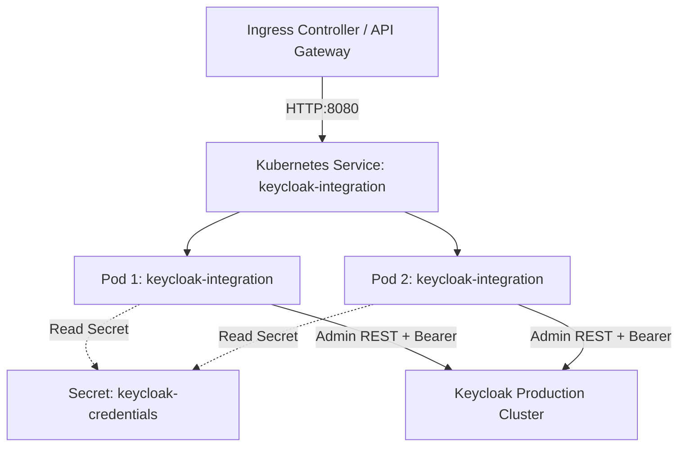

# User Manual and Deployment Guide: `PICC-PC-Keycloak-Integration`

This document provides a comprehensive operational and deployment manual for the **`PICC-PC-Keycloak-Integration`** microservice within the **Nubo Native Platform (NNP)**. It covers configuration, operational workflows, containerization, production deployment on Kubernetes, and troubleshooting.

---

## Table of Contents

1. [System Overview](#1-system-overview)
2. [User & Integration Manual](#2-user--integration-manual)
   - [Authentication & Token Interception](#authentication--token-interception)
   - [Error Response Structure](#error-response-structure)
   - [Core Integration Scenarios](#core-integration-scenarios)
   - [Complete API Endpoint Catalog](#complete-api-endpoint-catalog)
3. [Local Deployment Guideline](#3-local-deployment-guideline)
   - [Prerequisites](#prerequisites)
   - [Method 1: One-Click Docker Compose (Recommended)](#method-1-one-click-docker-compose-recommended)
   - [Method 2: Bare-Metal / Local CLI Setup](#method-2-bare-metal--local-cli-setup)
   - [Local Verification & Swagger Testing](#local-verification--swagger-testing)
4. [Production Deployment Guideline (Kubernetes)](#4-production-deployment-guideline-kubernetes)
   - [Production Architecture](#production-architecture)
   - [Kubernetes Manifests (Deployment, Service, Secret, ConfigMap)](#kubernetes-manifests)
   - [Resource Limits & Autoscaling](#resource-limits--autoscaling)
   - [Health Probes & Graceful Shutdown](#health-probes--graceful-shutdown)
5. [Troubleshooting & Operational Runbook](#5-troubleshooting--operational-runbook)

---

## 1. System Overview

The **Keycloak Integration Service** is an enterprise identity abstraction layer that mediates interactions between client microservices/portals and the Keycloak Identity and Access Management (IAM) server.

Instead of each microservice managing OAuth2 client credentials, parsing Keycloak token endpoints, or writing direct HTTP calls to Keycloak's administrative endpoints, the Keycloak Integration Service provides:
- Standardized REST endpoints for realm, client, user, role, and group administration.
- Transparent token lifecycle management via an automated Feign request interceptor.
- Centralized error translation and structured error responses.
- Automated multi-tenant environment provisioning (`/envrep/{envCode}`).

---

## 2. User & Integration Manual

### Authentication & Token Interception

Integrating applications call the Keycloak Integration Service over standard HTTP REST. The integration service autonomously handles authentication with Keycloak:
- Acquires an administrative JWT access token from the `master` realm.
- Automatically caches the token in-memory.
- Injects `Authorization: Bearer <token>` into all outgoing Keycloak Admin API requests.
- Validates token expiration before dispatch and transparently triggers a refresh token or client credentials renewal when expired.

### Error Response Structure

When Keycloak rejects an administrative operation (e.g., user not found, duplicate client ID, or invalid role), the service returns a standard `KeycloakExceptionMessage` JSON object:

```json
{
  "code": "404",
  "message": "User with username alex.doe not found in realm master"
}
```

Common HTTP status mappings:
- `400 Bad Request`: Validation failure or malformed payload.
- `401 Unauthorized`: Keycloak administrative credentials invalid.
- `404 Not Found`: Target realm, client, user, group, or role does not exist.
- `409 Conflict`: Resource already exists (e.g. username or client ID already taken).
- `500 Internal Server Error`: Downstream Keycloak connectivity or network failure.

---

### Core Integration Scenarios

#### Scenario A: Automated Tenant Provisioning (`/envrep/{envCode}`)

Provisions a new dedicated tenant realm, creates an administrative user, and assigns the `realm-admin` role to that user in one API call:

```bash
curl -X POST "http://localhost:8080/envrep/tenant-alpha" \
  -H "Content-Type: application/json" \
  -d '{
    "userId": "tenant.admin",
    "firstName": "Tenant",
    "lastName": "Administrator",
    "emailId": "admin@tenant-alpha.example.com",
    "password": "SecurePassword123!"
  }'
```

#### Scenario B: Registering an OIDC Service Client

Registers a confidential backend service client with service accounts enabled:

```bash
curl -X POST "http://localhost:8080/admin/realms/master/clients" \
  -H "Content-Type: application/json" \
  -d '{
    "clientId": "billing-service",
    "name": "Billing Microservice",
    "enabled": true,
    "protocol": "openid-connect",
    "publicClient": false,
    "bearerOnly": false,
    "serviceAccountsEnabled": true,
    "directAccessGrantsEnabled": false,
    "standardFlowEnabled": true,
    "redirectUris": ["https://billing.example.com/*"]
  }'
```

#### Scenario C: Creating a User & Assigning to a Group

1. **Create the User:**
```bash
curl -X POST "http://localhost:8080/admin/realms/master/users" \
  -H "Content-Type: application/json" \
  -d '{
    "username": "jane.smith",
    "email": "jane.smith@example.com",
    "firstName": "Jane",
    "lastName": "Smith",
    "emailVerified": true,
    "enabled": true,
    "credentials": [
      {
        "type": "password",
        "value": "InitialPass789!",
        "temporary": false
      }
    ]
  }'
```

2. **Add User to Group:**
```bash
curl -X PUT "http://localhost:8080/admin/realms/master/users/jane.smith/groups/Engineering"
```

#### Scenario D: Triggering Password Reset Email

```bash
curl -X PUT "http://localhost:8080/admin/realms/master/users/jane.smith/execute-actions-email/forgotpass"
```

---

### Complete API Endpoint Catalog

| Group | Method | Endpoint Path | Summary |
| :--- | :--- | :--- | :--- |
| **Realms** | `GET` | `/admin/realms` | List all realms |
| | `GET` | `/admin/realms/{realmName}` | Get realm configuration |
| | `POST` | `/admin/realms` | Create a new realm |
| **Clients** | `GET` | `/admin/realms/{realmName}/clients` | List all clients |
| | `GET` | `/admin/realms/{realmName}/clients/{clientId}` | Get client details |
| | `POST` | `/admin/realms/{realmName}/clients` | Create an OIDC client |
| | `PUT` | `/admin/realms/{realmName}/clients/{clientId}` | Update client settings |
| | `DELETE` | `/admin/realms/{realmName}/clients/{clientId}` | Delete a client |
| **Users** | `GET` | `/admin/realms/{realmName}/users` | List all users |
| | `GET` | `/admin/realms/{realmName}/users/{userId}` | Get user by username or ID |
| | `POST` | `/admin/realms/{realmName}/users` | Register a new user |
| | `PUT` | `/admin/realms/{realmName}/users/{userId}` | Update user attributes |
| | `DELETE` | `/admin/realms/{realmName}/users/{userId}` | Delete a user |
| | `PUT` | `/admin/realms/{realmName}/users/{userId}/reset-password` | Reset user password |
| | `PUT` | `/admin/realms/{realmName}/users/{userId}/groups/{groupName}` | Add user to group |
| | `DELETE` | `/admin/realms/{realmName}/users/{userId}/groups/{groupName}` | Remove user from group |
| | `PUT` | `/admin/realms/{realmName}/users/{userId}/execute-actions-email/forgotpass` | Trigger forgot password email |
| | `PUT` | `/admin/realms/{realmName}/users/{userId}/execute-actions-email/verifyemail` | Trigger email verification |
| **Roles** | `GET` | `/admin/realms/{realmName}/roles` | List realm roles |
| | `GET` | `/admin/realms/{realmName}/clients/{clientId}/roles` | List client roles |
| | `POST` | `/admin/realms/{realmName}/clients/{clientId}/roles` | Create client role |
| **Groups** | `GET` | `/admin/realms/{realmName}/groups` | List all groups |
| | `GET` | `/admin/realms/{realmName}/groups/{groupName}` | Get group details |
| | `POST` | `/admin/realms/{realmName}/groups` | Create a group |
| | `GET` | `/admin/realms/{realmName}/groups/{groupName}/role-mappings/clients/{clientId}` | Get client roles for group |
| | `GET` | `/admin/realms/{realmName}/groups/{groupName}/role-mappings/realm` | Get realm roles for group |
| | `POST` | `/admin/realms/{realmName}/groups/{groupName}/role-mappings/clients/{clientId}` | Map client roles to group |
| | `POST` | `/admin/realms/{realmName}/groups/{groupName}/role-mappings/realm` | Map realm roles to group |
| **Automation** | `POST` | `/envrep/{envCode}` | Automated environment replication |
| **Tokens** | `POST` | `/realms/{realmName}/protocol/openid-connect/token` | Obtain direct OAuth2 token |

---

## 3. Local Deployment Guideline

### Prerequisites

- Docker Desktop or Docker Engine (24+)
- Java Development Kit (JDK 21+)
- Maven Wrapper (`.\mvnw.cmd` on Windows, `./mvnw` on Linux/macOS)

### Method 1: One-Click Docker Compose (Recommended)

The provided `docker-compose.yml` launches both Keycloak 24 and the Keycloak Integration Service with zero external dependencies:

```bash
# 1. Start the stack
docker-compose up -d

# 2. View running containers
docker-compose ps

# 3. Stream service logs
docker-compose logs -f keycloak-integration
```

### Method 2: Bare-Metal / Local CLI Setup

If running Keycloak externally or in standalone mode:

1. **Configure Environment Variables**:
   ```bash
   export KEYCLOAK_URL=http://localhost:8081
   export KEYCLOAK_MASTER_REALM=master
   export KEYCLOAK_CLIENT_ID=admin-cli
   export KEYCLOAK_CLIENT_SECRET=""
   ```

2. **Build and Run**:
   ```bash
   ./mvnw clean package -DskipTests
   java -jar target/keycloak-integration-0.0.1-SNAPSHOT.jar
   ```

### Local Verification & Swagger Testing

- Navigate to [http://localhost:8080/swagger-ui.html](http://localhost:8080/swagger-ui.html).
- Explore the **Keycloak Integration** tag to execute live requests directly against your local Keycloak instance.

---

## 4. Production Deployment Guideline (Kubernetes)

### Production Architecture

In Kubernetes, the service runs as a stateless Deployment behind a Kubernetes Service (ClusterIP or NodePort) with ingress routing. Sensitive credentials (such as `KEYCLOAK_CLIENT_SECRET`) are stored in Kubernetes Secrets.



### Kubernetes Manifests

#### 1. Secret & ConfigMap (`keycloak-config.yaml`)

```yaml
apiVersion: v1
kind: ConfigMap
metadata:
  name: keycloak-integration-config
  namespace: platform-identity
data:
  PORT: "8080"
  SPRING_PROFILES_ACTIVE: "standalone"
  SPRING_CLOUD_CONFIG_ENABLED: "false"
  KEYCLOAK_URL: "http://keycloak.platform-identity.svc.cluster.local:8080"
  KEYCLOAK_MASTER_REALM: "master"
  KEYCLOAK_CLIENT_ID: "admin-cli"
---
apiVersion: v1
kind: Secret
metadata:
  name: keycloak-integration-secrets
  namespace: platform-identity
type: Opaque
data:
  # Base64 encoded client secret
  KEYCLOAK_CLIENT_SECRET: ""
```

#### 2. Deployment Manifest (`deployment.yaml`)

```yaml
apiVersion: apps/v1
kind: Deployment
metadata:
  name: keycloak-integration
  namespace: platform-identity
  labels:
    app: keycloak-integration
spec:
  replicas: 2
  selector:
    matchLabels:
      app: keycloak-integration
  template:
    metadata:
      labels:
        app: keycloak-integration
    spec:
      containers:
        - name: keycloak-integration
          image: picc-pc-keycloak-integration:latest
          imagePullPolicy: IfNotPresent
          ports:
            - containerPort: 8080
              name: http
          envFrom:
            - configMapRef:
                name: keycloak-integration-config
            - secretRef:
                name: keycloak-integration-secrets
          resources:
            requests:
              cpu: "100m"
              memory: "256Mi"
            limits:
              cpu: "1000m"
              memory: "1024Mi"
          readinessProbe:
            httpGet:
              path: /v3/api-docs
              port: 8080
            initialDelaySeconds: 15
            periodSeconds: 10
            timeoutSeconds: 5
          livenessProbe:
            httpGet:
              path: /v3/api-docs
              port: 8080
            initialDelaySeconds: 30
            periodSeconds: 15
            timeoutSeconds: 5
```

#### 3. Service Manifest (`service.yaml`)

```yaml
apiVersion: v1
kind: Service
metadata:
  name: keycloak-integration
  namespace: platform-identity
spec:
  type: ClusterIP
  ports:
    - port: 8080
      targetPort: 8080
      name: http
  selector:
    app: keycloak-integration
```

---

## 5. Troubleshooting & Operational Runbook

### Issue 1: 401 Unauthorized during Feign Admin Requests

- **Symptom**: Controller returns `401 Unauthorized` with message `KeycloakIntegrationException: Unauthorized`.
- **Root Cause**: Feign `RequestInterceptor` failed to obtain a valid access token or `keycloak.client_secret` is incorrect.
- **Remediation**:
  1. Verify credentials by running a direct curl to the Keycloak token endpoint:
     ```bash
     curl -X POST "http://<keycloak-host>:8080/realms/master/protocol/openid-connect/token" \
       -d "client_id=admin-cli" \
       -d "grant_type=client_credentials" \
       -d "client_secret=<secret>"
     ```
  2. If using `admin-cli`, verify in the Keycloak Admin Console that the client has `Service Accounts Enabled` and that the service account is assigned the `admin` realm role.

### Issue 2: Downstream Connection Refused

- **Symptom**: `I/O error on POST request ... Connection refused`.
- **Root Cause**: `KEYCLOAK_URL` is pointing to an unreachable host or port.
- **Remediation**:
  1. Check if Keycloak container/pod is healthy:
     ```bash
     docker ps | grep keycloak
     ```
  2. Inside the integration container, verify network reachability:
     ```bash
     nc -zv keycloak 8080
     ```

### Issue 3: Duplicate Resource Conflict (409 Conflict)

- **Symptom**: `409 Conflict: User already exists` or `Client already exists`.
- **Remediation**: Query `GET /admin/realms/{realmName}/users` or `GET /admin/realms/{realmName}/clients` first to verify presence before creation.
